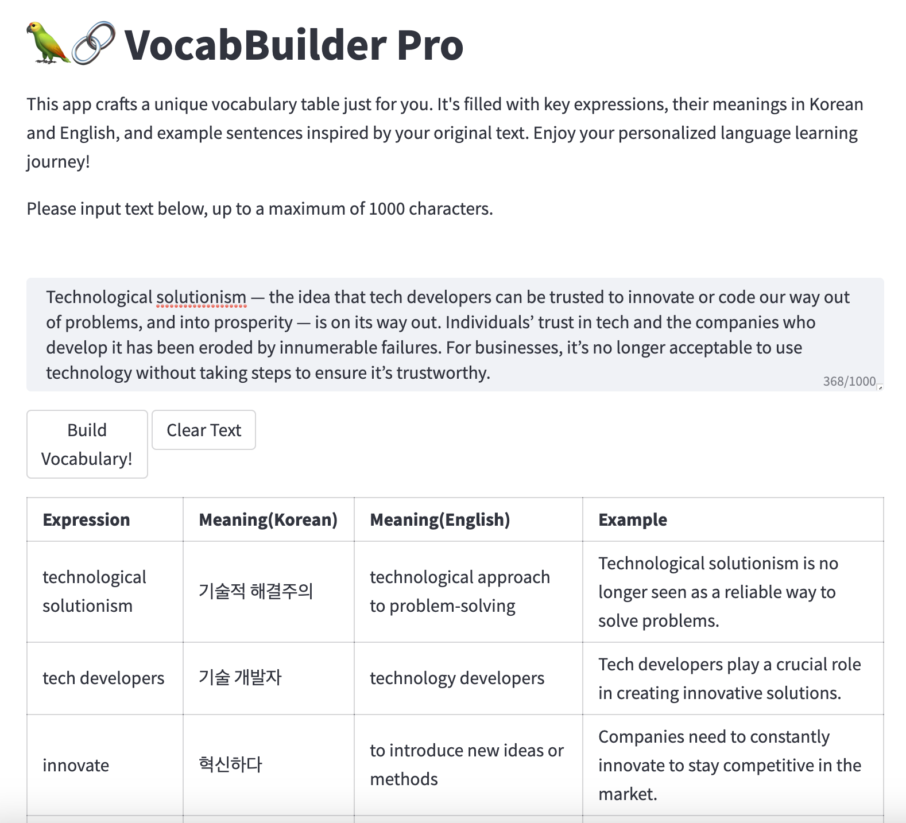

# VocabBuilder Pro: Customized Language Learning

## About The App

This app is designed to create a customized vocabulary table for you, offering an enriching and engaging language learning experience. With Vocabulary Builder, you're not just memorizing words - you're learning them in context and understanding their usage in real-world scenarios.

### Features

- **Key Expressions**: The app identifies and includes key expressions from your text, offering a focused approach to language learning.

- **Bilingual Meanings**: The app provides meanings of these key expressions in both Korean and English, bridging the gap between the two languages.

- **Example Sentences**: The app generates example sentences to give you a practical understanding of how these expressions are used. These aren't always direct quotes from your text, but are contextually similar to give you a real feel for the language.

## License

This app is licensed under the MIT License. See the [LICENSE](./LICENSE) file for details.